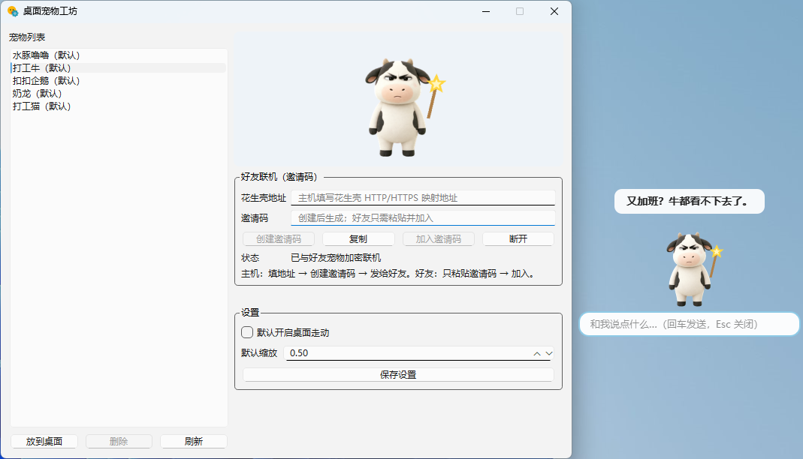

# Desktop Pet Workshop / 桌面宠物工坊

一个使用 Python 与 PySide6 构建的 Windows 透明桌面宠物应用：支持多宠物动画、配件、关键词互动、系统托盘，以及基于邀请码的一对一加密联机。

> A Windows desktop-pet application built with Python and PySide6. It combines animated transparent pets, pre-rendered accessories, keyword chat, tray controls, and encrypted peer-to-peer interaction through invitation codes.



> Demo videos are prepared in `release/效果图/` locally. Because `release/` is intentionally ignored by Git, upload the selected MP4 to the GitHub `v1.0.3` Release instead of committing it to the repository.

## Features

- Five built-in pets with real multi-frame animations: idle, walk, wave, jump, dance, think, shy, hit, vanish and appear
- Nine pre-rendered accessory sets with frame-by-frame alignment and cached switching
- Inline keyword chat with matching reactions and animation triggers
- One-to-one online mode with invitation codes, encrypted messages and synchronized manual actions
- Optional desktop walking, scaling, system-tray controls and single-instance protection
- Portable Windows build produced with PyInstaller; the target computer does not need Python

## Quick Start

Requirements: Windows 10/11 and Python 3.10 or newer.

```powershell
git clone https://github.com/dcjmessi/desktop-pet.git
cd desktop-pet
python -m venv .venv
.\.venv\Scripts\python -m pip install -r requirements.txt
.\.venv\Scripts\python -m app.main
```

也可以在依赖安装完成后双击根目录的 `run.bat`。

## 项目结构 / Project Structure

```text
desktop-pet/
├─ app/
│  ├─ core/       # 动画、精灵播放、行为控制和宠物包读取
│  ├─ services/   # 配件、素材处理和加密联机服务
│  ├─ ui/         # 宠物窗口与工坊窗口
│  └─ main.py     # 应用入口与生命周期
├─ assets/
│  └─ pets/       # 内置宠物帧、配件变体及素材声明
├─ scripts/
│  ├─ smoke_test.py
│  ├─ peer_smoke_test.py
│  ├─ online_ui_smoke_test.py
│  ├─ build_pets.py
│  └─ build_release.ps1
├─ desktop_pet.spec
├─ requirements.txt
└─ requirements-build.txt
```

## 使用说明

| 操作 | 说明 |
|---|---|
| 左键拖拽 | 移动宠物，仅非透明像素区域响应 |
| 双击宠物 | 打开内联聊天输入框 |
| 右键 → 做动作 | 招手、跳跃、跳舞、思考、害羞、打它 |
| 右键 → 配件 | 切换预烘配件 |
| 右键 → 缩放 / 桌面走动 / 打开工坊 | 调整常用设置 |
| 系统托盘 | 显示宠物、打开工坊或退出 |

## 互联网联机

联机模式一次连接两位用户，并且仅支持双方都具有的内置宠物。主机需要先将本机端口 `38475` 映射为可访问的 HTTP/HTTPS 地址，然后在工坊中创建邀请码；好友粘贴邀请码后即可加入。

聊天文字与动作数据使用端到端加密，映射服务只负责转发。HTTP 地址会转换为 `ws://`，HTTPS 地址会转换为 `wss://`。正式使用建议采用 HTTPS；映射服务是否支持 WebSocket 升级仍需按实际服务配置验证。

## Tests

项目包含三项可在无界面模式运行的 smoke tests，GitHub Actions 会在每次 push 和 pull request 时运行相同命令：

```powershell
.\.venv\Scripts\python scripts\smoke_test.py
.\.venv\Scripts\python scripts\peer_smoke_test.py
.\.venv\Scripts\python scripts\online_ui_smoke_test.py
```

- `smoke_test.py`：宠物加载、动作、配件、对话、窗口信号和设置持久化
- `peer_smoke_test.py`：本机回环下的加密聊天与动作同步
- `online_ui_smoke_test.py`：两个应用控制器之间的端到端联机 UI 流程

这些测试覆盖关键路径，但不替代真实 Windows 桌面交互、系统托盘和公网映射服务的人工验收。

## Build a Portable Windows Release

```powershell
.\.venv\Scripts\python -m pip install -r requirements-build.txt
powershell -ExecutionPolicy Bypass -File .\scripts\build_release.ps1
```

构建脚本会运行 PyInstaller，并生成：

```text
dist\DesktopPetWorkshop\
release\DesktopPetWorkshop-v1.0.3-win64.zip
```

发布包必须先完整解压再运行，不能只复制其中的 EXE。目标电脑无需安装 Python。

## 宠物素材重建

如已获得对应的 8 列精灵表，可将文件放入 `data/_sheet_cache/<id>.webp`，在 `scripts/build_pets.py` 的 `PETS` 中配置宠物后重建：

```powershell
.\.venv\Scripts\python scripts\build_pets.py
.\.venv\Scripts\python scripts\build_pets.py nailong
```

联网下载的实际可用性、来源条款和精灵表尺寸应由使用者再次核实。

## Built-in Pets

| ID | 名称 | README 中记录的来源 |
|---|---|---|
| `nailong` | 奶龙 | `erich207/nailong-codex-pet` |
| `dagongniu` | 打工牛 | Codex 桌宠画廊 `niumou--jarvis-2` |
| `salarycat` | 打工猫 | Codex 桌宠画廊 `salary-cat--zuochunjie` |
| `koukou` | 扣扣企鹅 | Codex 桌宠画廊 `koukou-penguin--hoody` |
| `capybara` | 水豚噜噜 | Codex 桌宠画廊 `capybara-lulu--jiushu` |

## License and Asset Notice

本仓库的 Python 源代码、脚本和项目配置采用 [MIT License](LICENSE)，但该许可证**不覆盖** `assets/pets/` 中的宠物图像、动画帧、配件帧及其他第三方资源。

内置宠物素材来自 README/`assets/pets/NOTICE.txt` 中记录的公开粉丝作品，仅用于个人学习与评估，不授权商用或再次分发。仓库中的来源记录不是完整的权利证明；在复制、修改、发布安装包或用于商业项目之前，必须由使用者向原作者核实授权。若无法确认授权，请替换或移除相关素材。

> The MIT License applies to the repository's source code, scripts, and project configuration only. It does not grant rights to bundled pet artwork, animation frames, accessory frames, or other third-party assets. Verify permission with the original creators before redistribution or commercial use.

## Tech Stack

Python 3.10+ · PySide6 · Pillow · cryptography · websockets · PyInstaller
